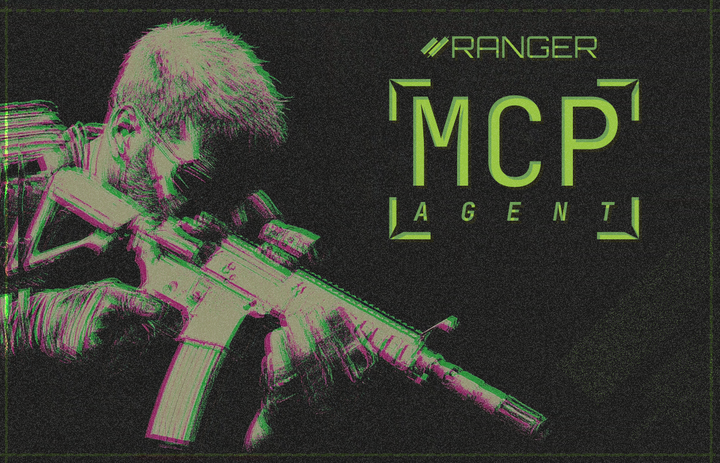

# 🛠️ Ranger Perps MCP – User Manual

<p align="center">
  
</p>

## Overview

The Ranger Perps MCP lets you interact with the perps mcp API using the Model Context Protocol (MCP). You can use it to fetch market data, get trade quotes, and prepare transactions for execution on Solana, all via a modular, LLM-friendly interface.

---

## 1. **Prerequisites**

- **Python 3.10+** (Recommended: 3.10, 3.11, or 3.12)
- **[uv](https://github.com/astral-sh/uv) package manager** (for fast, reliable Python environments)
- **git** (for cloning the repo)
- **A perps mcp API key** (get one from your perps mcp account)
- (Optional) **Node.js** (if you want to use the FastMCP Inspector UI)

---

## 2. **Clone the Repository**

```bash
git clone <your-repo-url>
cd perps-mcp
```

---

## 3. **Set Up a Python Virtual Environment**

```bash
uv venv
source .venv/bin/activate  # On Windows: .venv\Scripts\activate
```

---

## 4. **Install Dependencies**

```bash
cd ranger_mcp
uv pip install -e .
```

---

## 5. **Configure Your Environment**

1. **Create your `.env` file:**
   ```bash
   cp .env.example .env
   ```
2. **Edit `.env`** and set your actual Perps API key:
   ```
   RANGER_API_KEY="sk_test_..."
   RANGER_SOR_BASE_URL="https://staging-sor-api-437363704888.asia-northeast1.run.app"
   RANGER_DATA_BASE_URL="https://data-api-staging-437363704888.asia-northeast1.run.app"
   ```

---

## 6. **Run the MCP Server**

You can start the server in two ways:

### **A. Standalone (for Claude Desktop or other MCP clients):**

```bash
perps-mcp
```

or

```bash
python src/ranger_mcp/__main__.py
```

### **B. With FastMCP Inspector (for local testing and UI):**

```bash
fastmcp dev src/ranger_mcp/hub.py:ranger_mcp
```

- This opens a web UI where you can test all available tools.

---

## 7. **Using the MCP Server**

### **A. With FastMCP Inspector**

- Open the Inspector UI in your browser.
- You'll see all available tools (e.g., `sor_get_trade_quote`, `data_get_positions`).
- Click a tool, fill in the parameters, and run it to see the response.

### **B. With Claude Desktop**

- Add the MCP server as a plugin in Claude Desktop.
- Ask Claude to use Perps (e.g., "Get my positions using Perps").
- Claude will call the appropriate tool and return the result.

### **C. Programmatically (Python)**

You can also use the FastMCP Python client to call tools directly:

```python
from fastmcp import Client

client = Client("http://localhost:8000")  # Or use stdio transport
result = await client.call_tool("sor_get_trade_quote", params={...})
print(result)
```

---

## 8. **Available Tools**

- **SOR Tools:**
  - `sor_get_trade_quote`
  - `sor_increase_position`
  - `sor_decrease_position`
  - `sor_close_position`
  - `sor_withdraw_balance_drift`
- **Data Tools:**
  - `data_get_positions`
  - `data_get_trade_history`
  - `data_get_latest_liquidations`
  - `data_get_liquidation_totals`
  - ...and more!

Each tool's parameters and expected responses are visible in the Inspector UI or via the MCP OpenAPI schema.

---

## 9. **Troubleshooting**

- **Server won't start?**

  - Check your Python version (`python --version`)
  - Ensure `.env` is present and contains a valid API key.
  - Check for error messages in the terminal.

- **API errors?**

  - Make sure your API key is correct and has access.
  - Check the Perps API status.

- **Want more logs?**
  - Set `FASTMCP_SERVER_LOG_LEVEL="DEBUG"` in your `.env` for verbose output.

---

## 10. **Security Note**

- **Never commit your `.env` file** (it's in `.gitignore` by default).
- **Never share your API key**.

---

## 11. **Updating the Server**

To update dependencies or the code:

```bash
git pull
uv pip install -e .
```

---

## 12. **Getting Help**

- **perps mcp API docs:** [https://www.app.ranger.finance/trade](https://www.app.ranger.finance/trade)
- **FastMCP docs:** [https://modelcontextprotocol.io](https://modelcontextprotocol.io)
- **Ask your dev team or open an issue in your repo!**

---

## Integration Tests

- Integration tests use API keys from a `.env` file if present, or a default test key.
- See the README for details on running tests.

If you want a PDF or markdown version of this manual, or want to customize it for your team, just let me know!


