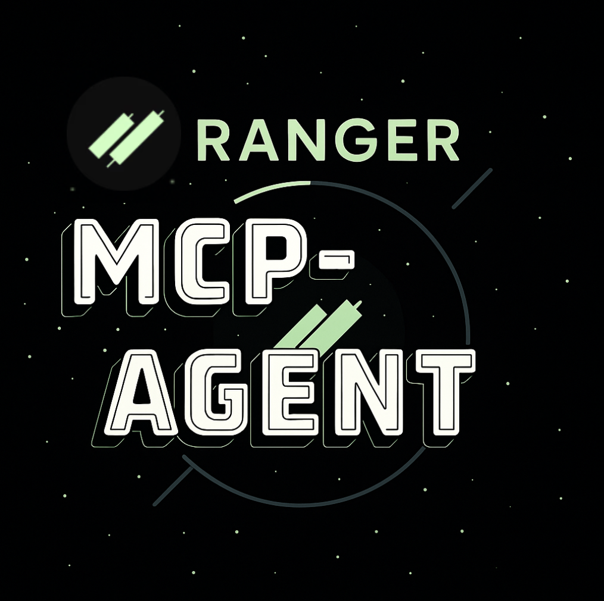

<p align="center">
  
</p>

# Ranger MCP Agent Examples

This folder demonstrates how to build AI agents that interact with the [Ranger Perps MCP Server](../ranger_perps_mcp/README.md) using the [Model Context Protocol (MCP)](https://modelcontextprotocol.io) and the [`mcp-agent`](https://github.com/lastmile-ai/mcp-agent) framework.

## What can you build with `ranger_perps_mcp`?

- **Automated Trading Agents:**
  - Fetch real-time market data, get trade quotes, and prepare transactions for perpetuals trading on Solana.
  - Use SOR tools to generate and manage trading transactions (increase, decrease, close positions, withdraw, etc.).
- **Portfolio Management Bots:**
  - Query open positions, trade history, and liquidation data for a given account.
  - Build dashboards or notification systems for portfolio health and risk.
- **LLM-Driven Workflows:**
  - Integrate with LLMs (like Claude, GPT-4, etc.) to create conversational trading assistants.
  - Use agent patterns (orchestrator, planner-evaluator, human-in-the-loop) to automate or semi-automate trading workflows.
- **Mean Reversion Trading:**
  - Use liquidation data to detect mean reversion opportunities and execute trades.
- **Funding Rate Arbitrage:**
  - Use funding rate data to detect arbitrage opportunities and execute trades.
- **Data-Driven Signals:**
  - Use market data to detect signals and execute trades.

## Example Agents

This folder contains example agents that demonstrate:

- Connecting to the Ranger MCP server as an MCP client
- Calling tools such as `sor_get_trade_quote` and `data_get_positions`
- Composing multi-step workflows using the [`mcp-agent`](https://github.com/lastmile-ai/mcp-agent) framework

See the `examples/` subfolder for runnable agent scripts and workflow patterns.

## Demo Trading Strategies 💲

Below are example LLM-driven trading workflows you can build using the Ranger Perps MCP server and agent patterns:

---

### 1. Mean Reversion Trading

- **Monitor liquidation volumes** using `data_get_latest_liquidations` and related tools
- **Calculate statistical deviations (Z-score):**
  - Identify unusual market liquidations that often lead to trading opportunities
  - Use LLMs or Python code to compute Z-scores on liquidation data
- **Execute trades during market capitulation events:**
  - Trigger SOR tools (e.g., `sor_get_trade_quote`, `sor_increase_position`) when signals are detected

**Example: Mean Reversion Trading Agent**

Below is a simplified example of a mean reversion agent that:

- Fetches recent liquidation data
- Calculates a Z-score for the latest liquidation volume
- If the Z-score exceeds a threshold, it prepares a trade quote and (optionally) a transaction

See [`examples/mean_reversion_agent.py`](examples/mean_reversion_agent.py) for a runnable version.

## How to Run the Example Agents

1. **Install dependencies:**
   ```bash
   pip install mcp-agent numpy
   ```
2. **Start the Ranger MCP server:**
   - Follow the instructions in [USER_MANUAL.md](../ranger_perps_mcp/USER_MANUAL.md) to start the server (default: `http://localhost:8000`).
3. **Set your account address:**
   - Edit the `ACCOUNT` variable in the example scripts to your Solana account address.
4. **Run an example agent:**
   ```bash
   python examples/single_tool_call_agent.py
   # or
   python examples/orchestrator_agent.py
   # or
   python examples/mean_reversion_agent.py
   # etc.
   ```
5. **(Optional) Change MCP server URL:**
   - If your MCP server is running elsewhere, update the `base_url` in the scripts.

See the `examples/` folder for more agent patterns and details.

### 2. Funding Rate Arbitrage

- **Exploit funding rate differentials between venues:**
  - Use tools like `data_get_funding_arbs` and `data_get_oi_weighted_funding_rate`
- **Automated spread capture:**
  - LLM/agent logic can monitor and act on funding rate spreads
- **Risk-managed position execution:**
  - Combine with position monitoring and liquidation data for safer trades

### 3. Data-Driven Signals

Key metrics available via MCP tools:

- **Daily Summary:**
  - Compile your own account summaries using `data_get_positions`, `data_get_trade_history`
- **OI Weighted Funding Rate analysis:**
  - Assess market bias and spot potential reversals
- **Open Interest tracking:**
  - Use OI data to monitor market participation and crowding
- **Trade history & Position monitoring:**
  - Build dashboards or alerting agents for your portfolio

---

These strategies can be implemented as LLM-driven agents, using the example patterns and tools provided in this repo.

## References

- [Ranger Perps MCP Server](../ranger_perps_mcp/README.md)
- [USER_MANUAL.md](../ranger_perps_mcp/USER_MANUAL.md)
- [`mcp-agent` framework](https://github.com/lastmile-ai/mcp-agent)
- [Anthropic agent patterns](https://github.com/anthropics/anthropic-cookbook/tree/main/patterns/agents)

## Summary

This repository enables rapid prototyping of LLM-driven trading agents and bots for Solana perps using the Ranger MCP server. With modular agent patterns, real-time data, and trading tools, you can:

- Build, test, and iterate on your own trading strategies
- Leverage both code and LLMs for signal generation, risk management, and execution
- Extend the provided examples to suit your workflow or research

Experiment, adapt, and unlock the potential of the markets with Ranger and AI!
